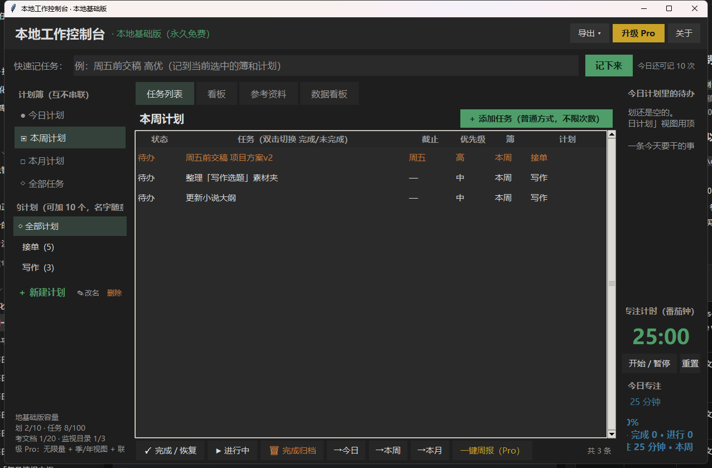

# 本地工作控制台（Local Work Console）

> 一个装在 Windows 电脑上的**个人计划管理工具** —— 工作、学习、生活、接单都能管。它管的是「事」，不是文件。
> 干什么用：把每天要干的事记下来、分进各个计划、盯着推进、做完打勾 —— 打开就知道今天该干什么，一周干成了什么一眼看得清。
> 它不是网盘、不是笔记软件，也不是文件管理器。

**一句话**：给"一个人 + 一台 Windows 电脑"用的本地计划工作台 —— 打开就能记，数据永不出硬盘。
**给谁**：想把计划、任务、资料在电脑上理清楚的人 —— 上班族、学生、创作者、自由职业者都行，不限定职业。
**凭什么**：10 个计划槽随便命名、今日/本周/本月三本独立簿、一句话快速记任务自动拆截止和优先级；基础版**永久免费**，无广告、不阉割、不拿数据当人质。

`本地基础版 v0.3.1（永久免费）` · `MIT License` · `Windows 10/11` · `单文件 exe ≈ 11 MB` · `零联网` · `数据 = data/ 一个文件夹`

> **Pro 版（基础版之外的进阶能力）已上线，在爱发电 / 闲鱼下单** —— 本仓库只提供免费版下载 → 见下方「购买 Pro」。

- 版本：v0.3.1（本地基础版，**永久免费**）
- 形态：单文件 exe（约 11 MB），解压双击即用，免安装、免注册
- 系统：Windows 10 / 11（作者在 Windows 11 上开发验证）
- 数据：全部存在程序目录下的 `data/` 文件夹，零上传、零联网

---

## 界面

真实主界面（左侧四本计划簿 + 中间任务区 + 右侧番茄钟/今日待办）：

## 它是给谁用的

- **手上事多且杂的人**：工作、学习、生活的事混在一起，需要一个地方把它们分门别类理清楚
- **想自己掌控数据的人**：计划、资料、私人文件不想躺在别人服务器上，只想留在自己电脑里
- **讨厌注册和订阅的人**：打开就想用，不想先填一遍手机号再学 20 分钟
- **就想在一台电脑上把自己管明白的人**：不需要多端同步、团队协作，这台机器就是你的工作台

不限定职业：上班族用它管周计划，学生用它管作业和论文，创作者用它管选题和交稿，自由职业者用它管客户和项目——都行。计划名随你起，工具不替你预设人生。

## 它能干什么（大白话）

| 能力 | 说明 |
|---|---|
| 计划三本簿 | 「今日 / 本周 / 本月」三本独立计划，互不自动串动；任务手动放哪本就待在哪本 |
| 快速记任务 | 顶部输入框敲一句人话（如「周五前交稿 高优」），自动拆出截止时间、优先级；基础版每天 10 次，普通添加不限次数 |
| 列表 + 看板 | 表格视图双击切换完成；看板三列拖节奏（待办→进行→完成） |
| 计划随你命名 | 最多 10 个计划，名字随便起（写作、学习、客户跟进、任务1……都可以），可改名 |
| 参考资料 | 把合同、需求文档、素材文件夹"引"进来**只读查看**（只存路径、不读内容），双击用系统打开，不与任务联动 |
| 番茄钟 | 25 分钟专注计时，当日/本周专注时长统计 |

## 免费版到底免到什么程度（不阉割、不绑架）

| 项 | 基础版（永久免费） |
|---|---|
| 计划 | 10 个（名字自定义） |
| 任务 | 100 条 |
| 参考文档 | 20 份 |
| 监视文件夹 | 3 个 |
| 快速记任务 | 每天 10 次（普通添加不限） |
| 广告 / 弹窗 | 无 |
| 账号 / 注册 | 不需要 |
| 联网 | 不需要（软件本身没有网络功能） |
| 导出 | Markdown / CSV，随时带走 |

三条承诺：
1. **免费不是试用** —— 基础版是完整工具，能真实管计划、任务、参考和时间；
2. **不绑架数据** —— 超过容量只拦"新增"，已存数据随时可看、可导出、可带走；
3. **Pro 不锁已有功能** —— Pro 加的是"数据看板、一键周报、完整迁移、自动备份、季度/年度簿、标签全局搜索、计划模板"这类基础版没有的能力（68 元一次买断，在爱发电 / 闲鱼下单；本仓库下载页只有免费版）。

## 怎么用

1. 下载 `LocalWorkConsole_v0.3.1_Free.exe`（Release 页）；
2. 放进一个固定文件夹（比如 `D:\我的工作台\`），双击打开 —— 首次启动会在旁边自动建 `data/` 存数据；
3. 左侧「＋新建计划」起个名字，开始记。

> 小提示：程序是"绿色单文件"，**不要**直接放在桌面/下载文件夹双击长期使用（容易误删数据文件）；建议放固定目录。数据都在 `data/console.db`，重装系统前把它备份走即可。

## 常见问题（FAQ）

**Q：免费版够用吗？**
A：10 个计划 + 100 条任务 + 无广告，是完整工具不是试用。绝大多数个人日常完全够；到容量上限时也只是不能新增，老数据随时导出带走。

**Q：支持手机吗？**
A：目前只做 Windows 电脑（单机）。它定位是"你办公这台电脑上的工作台"，不打算做成全平台云工具 —— 那意味着你的数据要上传，违背初衷。

**Q：数据安全吗？会丢吗？**
A：数据存在你电脑本地，软件没有联网代码，谁也拿不走。但**本地数据需要你自己备份**（程序菜单可导出 md/csv，或直接复制 data 文件夹）——这是本地工具的代价，也是它的价值。

**Q：要收费吗？**
A：基础版永久免费。Pro 版（数据看板、一键周报、完整迁移、自动备份、季度/年度簿、标签全局搜索、计划模板，68 元一次买断永久用）已上线，在爱发电 / 闲鱼下单，入口见下方「购买 Pro」。**本仓库下载页只有免费版，Pro 不放这里**。付费前你可以一直用基础版。

**Q：和滴答清单 / Todoist / 微软待办有什么区别？**
A：那些是优秀的云工具：多端同步、团队协作是它们的长处。本工具反过来：**免账号、免安装、不联网、数据不出机** —— 适合"我就想在这台电脑上把自己管明白"的人。没有云同步，是特性不是缺陷（见上）。

## Free / Pro

- **基础版（永久免费）**：见上表。
- **Pro（68 元一次买断，在爱发电 / 闲鱼下单；本仓库下载页不含 Pro）**：计划/任务/资料不设上限、数据看板、一键周报、完整迁移、自动备份、季度/年度簿、标签全局搜索、计划模板。只收一次钱，以后永不订阅。

## 购买 Pro

- **爱发电**：https://afdian.com/item/4d16b7f2af1d11f180d852540025c377
- **闲鱼**：搜「本地工作控制台 Pro」

为什么 Pro 不放在 GitHub 下载页：里面是离线授权码，公开下载等于把激活方式一起送出去。所以免费版在仓库随便下，Pro 走上面两个渠道下单。

付款后把软件里一键复制的机器码发我，回你一串授权码，粘进去即时解锁 —— **全程离线，不联网、不注册账号**。一码绑一台电脑，换机或重装拿新码重出，一次 10 秒。

## 已知边界（诚实声明）

- 仅 Windows（作者在 Win11 开发验证）；无手机端、无云同步、无提醒推送；
- 界面走"朴素轻快"路线（原生控件），不追求花哨皮肤；
- 数据备份依赖用户自己（导出或拷贝 data 目录）。

---
© 夜猫子小强（XiaoQiangDev） · 开源协议见仓库 LICENSE

## 📮 反馈与建议

用着有问题、想要什么功能、或者就是想吐槽 —— 直接开个 Issue，我每天都看：
https://github.com/aks-666888/local-work-console/issues

你的反馈决定下一个版本往哪走。

---

## 💛 支持作者

工具永久免费开源。如果它帮到了你，欢迎到爱发电请我喝杯奶茶：
https://afdian.com/a/xiaoqiangdev

你的支持让我能持续更新更多效率工具。
